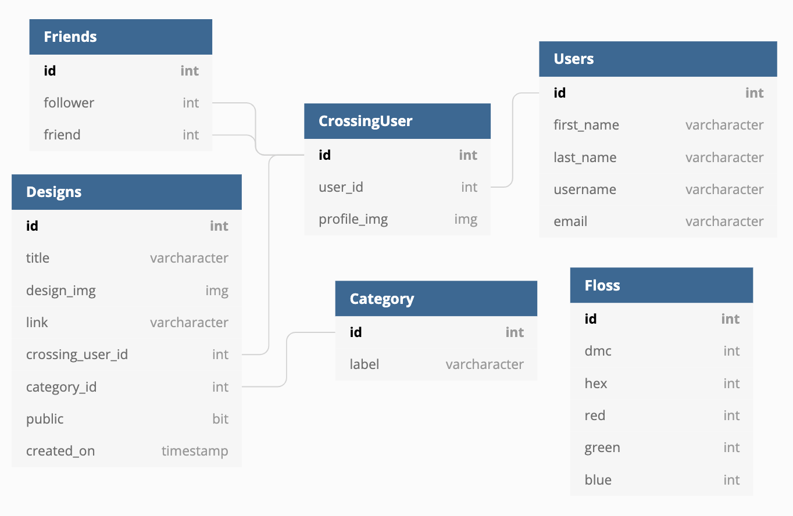

# Welcome to Crossing Paths Server!

> to see the front end repository [click here](https://github.com/egeehartz/crossing-paths-client)

## Learning Goals

- Become more comfortable working with Django REST Framework
    - custom actions specifically
- Set up the models and ViewSets to allow users to upload images

## Features

The back end handles data in a variety of ways.

The CrossingUser and Design models have non-mapped properties to send useful information along with the objects stored in the database.

The CrossingUser and Design ViewSets have actions to either send very specific data to the front end or perform a specific task. 
- In CrossingUser, the    ```people_to_follow``` action prevents friends from showing up when a user is typing in the user search bar. 
- In Design ViewSet the ```explore``` axction filters all the designs so that only the public designs and the private designs made by friends are shown on the Explore page. 
    - This allowed the front end to use a single function to retrieve the necessary designs without any additional filtering on the client side. 

## Set Up

1. clone this repo
2. Activate virtual environment by typing ```pipenv shell```
3. Install dependencies
    - ```pipenv install```
    - Install [Pillow](https://pillow.readthedocs.io/en/stable/installation.html)
4. Run the server ```python manage.py runserver```
5. Checkout the front end [repository](https://github.com/egeehartz/crossing-paths-client) for more instructions

## Testing in Postman

I built out the majority of the server side before moving on to client side code. To test my endpoints I used [Postman](https://www.postman.com/)

<details><summary>Endpoints</summary>

GET (all)
- /designs
- /users
- /categories
- /follows

GET (one or some)
- /designs/#
- /designs?category_id=#
- /designs?user_id=#
- /users/#
- /categories/#
- /follows/#
- /follows?follower_id=#
- /follows?friend_id=1
- /currentuser
- /users/people_to_follow (@action)
- /designs/explore (@action)

 POST
 - /designs
 - /users
 - /follows

PUT
- /designs/#

DELETE
 - /designs/#
 - /follows/#


</details>

<br />

## ERD



## Author

Emily Hartzell - [GitHub](https://github.com/egeehartz), [LinkedIn](www.linkedin.com/in/emilyhartzell), [Personal Website](https://egeehartz.github.io)